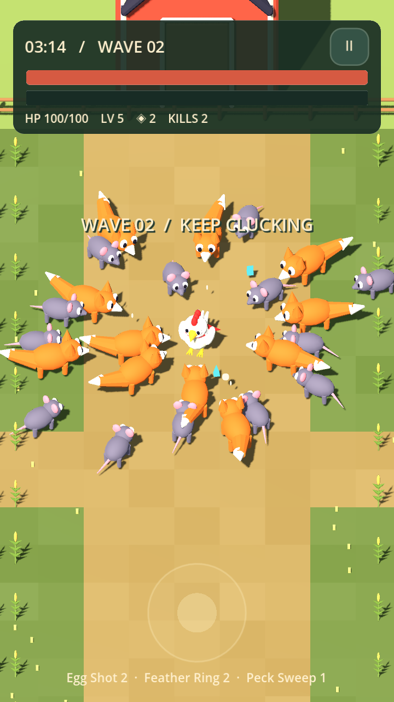
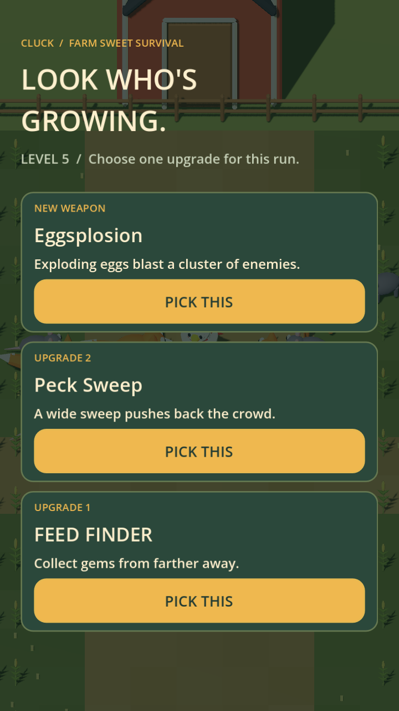

# Cluck

**Small bird. Big problems.** A playable, portrait 3D farm survival game built with Godot and original Blender assets.

[Download Android and Mac builds](https://github.com/prateek-9207/cluck/releases/tag/v0.1.0) · [Build instructions](docs/BUILD.md) · [Design](docs/DESIGN.md) · [Validation](docs/VALIDATION.md)

## Play

Three patches provide approximately 15 minutes of combat content: The Farmyard, Cornfield Chaos, and The Last Barn. Dodge rats, foxes, charging boars and tough cows, then defeat each patch's boss.

- One-thumb movement and automatic attacks.
- Four attacks and five types of temporary upgrades.
- Coins retained after attempts, including defeats.
- Permanent stat upgrades and three selectable starting weapons.
- Local saves, music, sound controls and pause/resume.
- No ads, payments, accounts or online services.

On Android, install the APK. On Mac, unzip and open Cluck.app. To run from source, open `project.godot` in Godot 4.7.2. Desktop controls: WASD/arrows or mouse drag; Escape pauses.

## Screenshots

Screenshots are staged inside the real game to make the characters and interface visible. They are not paintovers.

 

## Project

- `scripts/`: gameplay, save/purchase logic and touch joystick.
- `assets/`: original exported models and audio.
- `art/`: editable Blender source and asset-generation scripts.
- `tests/`: reproducible lifecycle/campaign tests and local export helper.

This is a small playable prototype. Android emulator startup, desktop play and automated progression checks are covered; physical-phone performance and broader player balance testing remain open.
